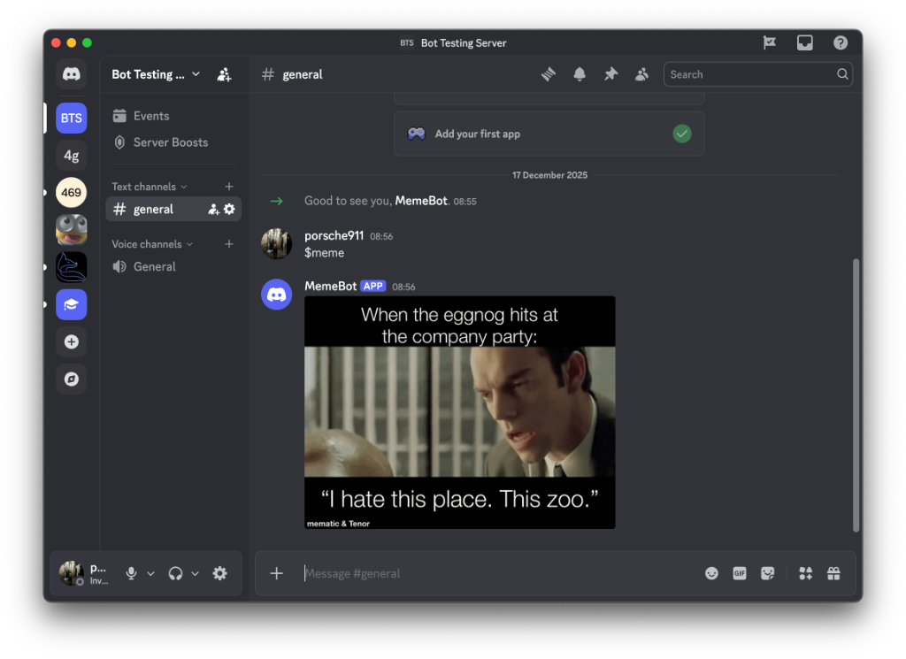

# Discord Meme Bot

A Python application that delivers random memes to Discord servers using asynchronous event handling and REST API integration.



## Overview

This project demonstrates the implementation of a Discord bot using the `discord.py` library. It showcases asynchronous programming patterns in Python, API consumption, and real-time event handling. The bot listens for specific commands and interacts with the Reddit Meme API to fetch and display content dynamically.

## Technical Highlights

- **Language**: Python 3.8+
- **Libraries**: `discord.py` (Async API wrapper), `requests` (HTTP client), `python-dotenv` (Configuration management)
- **Architecture**: Event-driven asynchronous design
- **Integration**: RESTful API consumption (Meme API) with JSON parsing

## Key Features

- **Asynchronous Event Handling**: Utilizes Python's `async/await` syntax for non-blocking I/O operations.
- **REST API Integration**: Fetches real-time data from external endpoints.
- **Secure Configuration**: Implements environment variable management for sensitive credentials.
- **Robust Error Handling**: Designed to handle API response variations and network states.

## Installation & Setup

1. **Clone the repository**
   ```bash
   git clone https://github.com/coderG13/discord-meme-bot.git
   cd discord-meme-bot
   ```

2. **Install dependencies**
   ```bash
   pip install -r requirements.txt
   ```

3. **Configure Environment**
   Create a `.env` file in the root directory:
   ```env
   DISCORD_TOKEN=your_discord_bot_token
   ```

4. **Run the Application**
   ```bash
   python3 bot.py
   ```

## Usage

- Invite the bot to your server.
- Type `$meme` in any text channel.
- The bot will asynchronously fetch and display a random meme.

## License

MIT License - see the [LICENSE](LICENSE) file for details.
